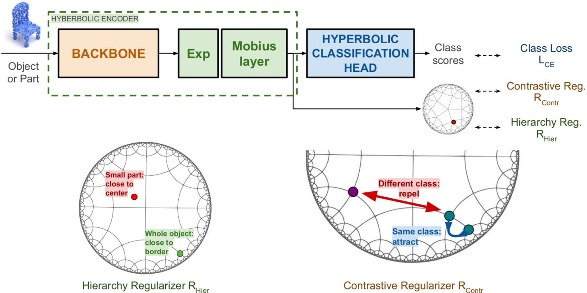

# HyCoRe - Rethinking the compositionality of point clouds through regularization in the hyperbolic space

[](https://paperswithcode.com/sota/3d-point-cloud-classification-on-modelnet40?p=rethinking-the-compositionality-of-point)
[](https://paperswithcode.com/sota/3d-point-cloud-classification-on-scanobjectnn?p=rethinking-the-compositionality-of-point)

Official PyTorch implementation of the paper "Rethinking the compositionality of point clouds through regularization in the hyperbolic space" (NeurIPS 2022)

**TL;DR:** We propose a new regularization technique in the hyperbolic space, called HyCoRe, to boost the performance of any Point Cloud classification architecture.

<p align="center">

</p>


## Features
Our code is based based on the [**PointMLP**] project (https://github.com/ma-xu/pointMLP-pytorch) and the [**Geoopt**](https://github.com/geoopt/geoopt) library for neural networks in the hyperbolic space. Check the PointMLP repo for issues on environments and dependencies.
This repository provides the implementation for the PointMLP and DGCNN models, on the ModelNet40 and ScanobjectNN datasets. For DGCNN and PontMLP we use the respective official architecture designs, and keep the original preprocessing and hyperparameters. Notice that applying HyCoRe is straightforward leading to an easy adaptation of the code to any project.


## Installation

```
conda create -n hycore python=3.7 -y
conda activate hycore
conda install pytorch==1.10.1 torchvision==0.11.2 cudatoolkit=10.2 -c pytorch -y
# if you are using Ampere GPUs (e.g., A100 and 30X0), please install compatible Pytorch and CUDA versions, like:
# pip install torch==1.8.1+cu111 torchvision==0.9.1+cu111 torchaudio==0.8.1 -f https://download.pytorch.org/whl/torch_stable.html
pip install cycler einops h5py pyyaml==5.4.1 scikit-learn==0.24.2 scipy tqdm matplotlib==3.4.2
pip install pointnet2_ops_lib/.
pip install geoopt
```

## Usage 

**launcher_[architecture_name].sh can be run with default setting.**  

Examples:  
1. Train and validate on ScanObjectNN using DGCNN+HyCoRe: `python main_dgcnn_hycore.py --epoch=250 --learning_rate 0.1 --msg=Offv_dgcnn_hycore_var --workers=8`.  
2. Train and validate on ModelNet40 using PointMLP+HyCoRe: `python main_pointmlp_hycore.py --msg=Offv_pointmlp_hycore_var --workers=8`.


## Citation
If you find our work useful in your research, please consider citing: 

```
@inproceedings{montanaro2022rethinking,
 author = {Montanaro, Antonio and Valsesia, Diego and Magli, Enrico},
 booktitle = {Advances in Neural Information Processing Systems},
 title = {Rethinking the compositionality of point clouds through regularization in the hyperbolic space},
 year = {2022}
}
```

## Pretrained models

Coming soon!

## License 
Our code is released under MIT License (see LICENSE file for details).
